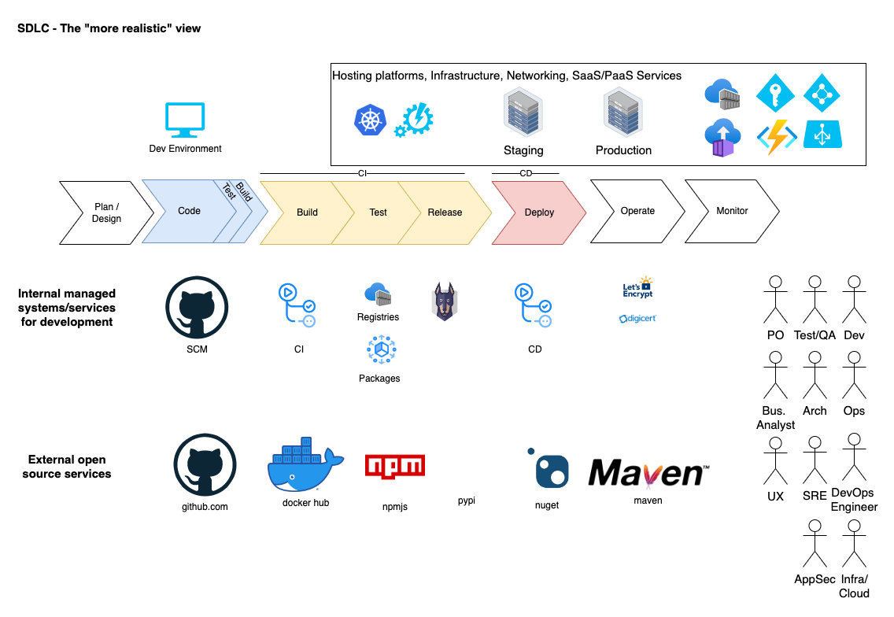

# The SDLC, where and when to scan for secrets

Our Software Development Life Cycle (SDLC) can be quite complex. This is one example of a "typical" SDLC.

-- Discussions --

- We typically use secrets all over the SDLC and should treat them carefully
- Where does it make sense to scan?
- One pattern
    - Scan while developing locally in IDE (using Snyk)
    - Scan in your local build process (using Trufflehog)
    - Scan as a git-precommit, stop Secrets from reaching the git history
    - Scan Github repos on a scheduled basis
    - Scan container images, in build and monitor container registries regularly
- Other options
    - Scan logs 
- Challenges
    - Are the secrets "verified" or "active"?
    - Should we treat scanning of "public" repo different than "internal" and "private" ones?

